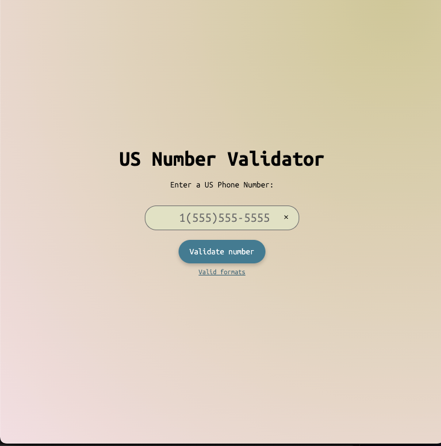
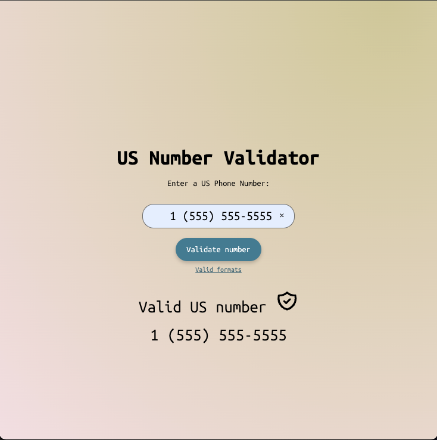
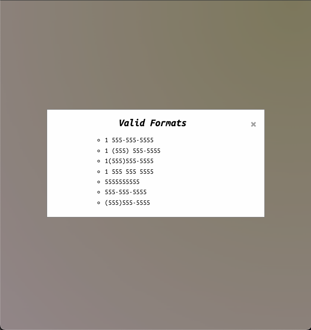

# US Phone Number Validator App

This project is part of the FreeCodeCamp certification and serves as a US phone number validator application.

## Screenshots

## Overview

The US Phone Number Validator App allows users to input a phone number and validates whether it is in the correct format for a US phone number.

## Features

- Validates US phone numbers.
- Provides feedback on whether the entered phone number is in the correct format.

## Technologies Used

- HTML
- CSS
- JavaScript

## How to Use

1. Input a phone number into the designated field.
2. Click the "Validate" button.
3. Receive feedback on whether the entered phone number is valid or not.
4. Click the "Show Formats" button to view the modal containing US phone number formats.

## Deployment

This app is deployed using Netlify. You can access it [here](#).

Open the `index.html` file in your preferred web browser to view the app locally.

## Resources

For more information on how to validate phone numbers using JavaScript, refer to the [W3Schools documentation on Regular Expressions](https://www.w3schools.com/js/js_validation.asp).

## Credits

This project was created as part of the FreeCodeCamp curriculum.

